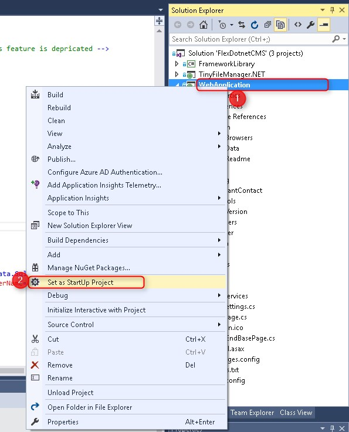
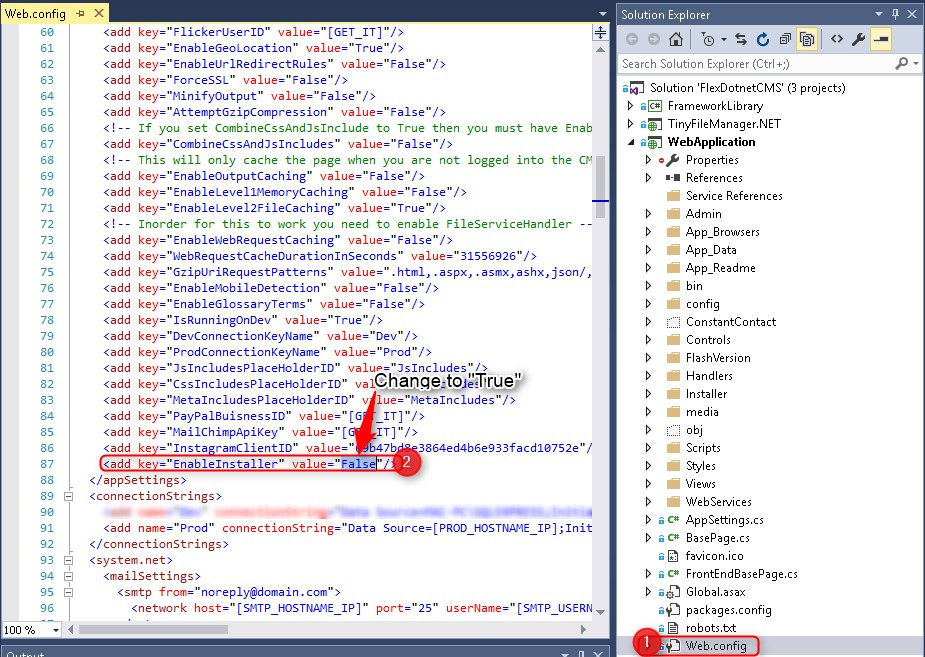
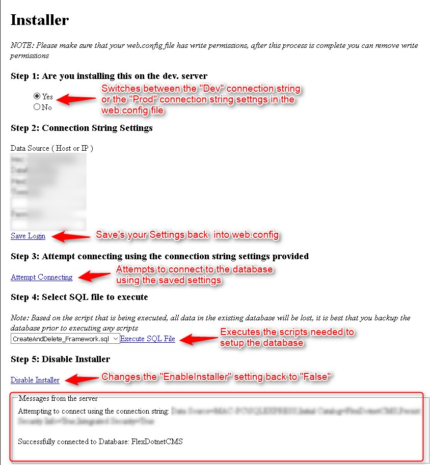
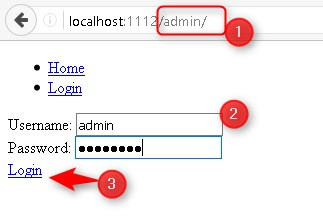
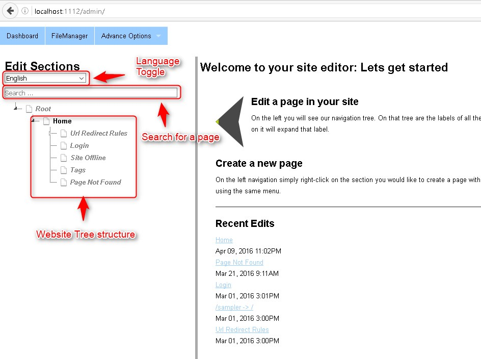
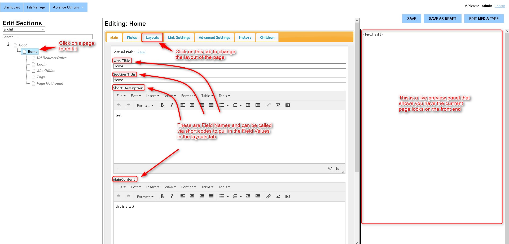
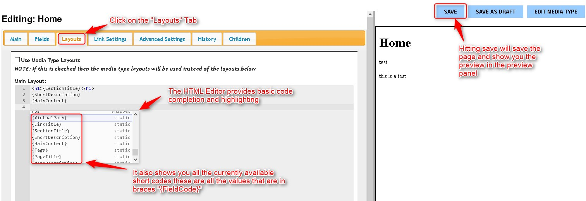

# FlexDotnetCMS
A powerful, flexible and easy to use ASP .NET CMS

# Below is what you will need inorder to get started
- Visual Studio Community 2015 
- .NET 4.5.2 + ( will keep updating this as new versions come out )
- Microsoft SQL Server 2012 + ( might work with older versions )
- Microsoft SQL Server Management studio 2012 + ( Once again might work with older versions )

#Getting Started
- Download the zip file and unzip it to a folder
- Double click the .sln file, this should open the solution consisting of 3 projects
- Right click on the "WebApplication" Project and set it as the "Start Up project"

- Open up the "Web.config" file under the "WebApplication" project and search for the AppSetting "EnableInstaller" and set its value to "True"

- Create a new empty database in SQL Server
- Now you can run the project
- Follow the steps in the installer, this will update the "Web.Config" with your DB connection information and execute the .sql scripts needed to setup the database, in the final step you will be asked to "Disable The installer" click on this link and you will be done.

- You can now login to the CMS by going to [domain]/admin/
- The default username is: admin
- The default password is: password

- Once you login you will see something similar to the screenshot below

#Editing a page
- Click on a node in the site tree
- You will now be taken to a page with an editing area and a preview panel

- The way I have descided to structure the CMS is that it splits up the Content of the page and the Layout of the page.
- Inorder to change the layout of the page you will need to click on the "Layouts" Tab
- The layout of the page is determend by the HTML that you place in the "Main Layout" Editor
- The way it works is you can enter whatever HTML you would like to structure the page, and then simply put short codes in places you want to pull in fields
- The HTML Editor also provides basic code completion and syntax highlighting, including code completion for the shortcodes
- Short codes are denoted by braces "{FieldCode}" for example: {SectiontTitle} will pull in the section title field from the "Main" Tab, {MainContent} will pull in the value entered in the "Main Content" Field under the "Main" Tab etc.

